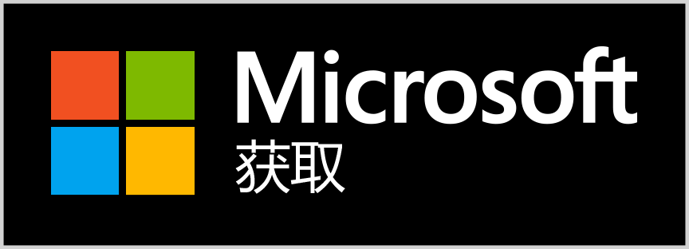

# 开发者工具

<p align="center">
  
</p>

<p align="center">
  <strong>轻量级开发者工具箱，助力日常开发任务</strong>
</p>

<p align="center">
  <a href="#功能">功能</a> •
  <a href="#api">API</a> •
  <a href="#安装">安装</a> •
  <a href="#使用">使用</a> •
  <a href="#开发">开发</a> •
  <a href="README.md">English</a>
</p>

---

## 功能

- **MD5 哈希计算** - 计算 32 位和 16 位 MD5 哈希值（大写/小写）
- **条形码生成器** - 生成 CODE 128 条形码
- **二维码生成器** - 为文本/网址生成二维码
- **Base64 ↔ 图片** - Base64 字符串与图片互转
- **JSON 格式化** - 格式化、展开、折叠 JSON 数据
- **URL 编码/解码** - 对 URL 字符串进行编码和解码
- **字符串转义/反转义** - 转义和反转义特殊字符
- **二维码/条形码识别** - 从图片中识别和解析二维码、条形码
- **随机字符串生成** - 生成可配置选项的随机字符串
- **手写签名** - 绘制签名并转换为 Base64 或保存为图片
- **RESTful API** - 所有工具可通过 HTTP API 访问，支持 AI 代理集成

## RESTful API

DevTools 现在提供 RESTful API 服务器，将所有工具功能暴露为 HTTP 端点。这允许 AI 代理和其他应用程序以编程方式访问所有功能。

### 快速开始

1. 在 `App.config` 中启用 API 服务器：
```xml
<appSettings>
    <add key="EnableApiServer" value="true"/>
    <add key="ApiServerPort" value="5000"/>
</appSettings>
```

2. 运行 DevTools 应用程序 - API 服务器会自动启动

3. 调用 API 端点：
```bash
# 健康检查
curl http://localhost:5000/api/health

# MD5 哈希
curl -X POST http://localhost:5000/api/md5 \
  -H "Content-Type: application/json" \
  -d '{"input":"hello world"}'

# 生成二维码
curl -X POST http://localhost:5000/api/qrcode \
  -H "Content-Type: application/json" \
  -d '{"text":"https://example.com","width":300,"height":300}'
```

### 可用的 API 端点

| 端点 | 方法 | 描述 |
|------|------|------|
| `/api/health` | GET | 健康检查 |
| `/api/md5` | POST | MD5 哈希计算 |
| `/api/json/format` | POST | JSON 格式化 |
| `/api/json/validate` | POST | JSON 验证 |
| `/api/url/encode` | POST | URL 编码 |
| `/api/url/decode` | POST | URL 解码 |
| `/api/escape` | POST | 字符串转义 |
| `/api/unescape` | POST | 字符串反转义 |
| `/api/base64/encode` | POST | Base64 编码 |
| `/api/base64/decode` | POST | Base64 解码 |
| `/api/qrcode` | POST | 生成二维码 |
| `/api/barcode` | POST | 生成条形码 |
| `/api/barcode/formats` | GET | 获取支持的条形码格式 |

### API 文档

完整的 API 文档，请查看：
- **[API/README.md](API/README.md)** - 完整 API 文档
- **[API/EXAMPLES.md](API/EXAMPLES.md)** - 使用示例（Python、JavaScript、cURL、PowerShell）
- **[API/QUICK_REFERENCE.md](API/QUICK_REFERENCE.md)** - 快速参考指南

## 安装

根据您的平台下载最新版本：

| 平台 | 架构 | 下载 |
|------|------|------|
| Windows | x64 (64位) | `DevTools-win-x64.exe` |
| Windows | x86 (32位) | `DevTools-win-x86.exe` |
| Windows | ARM64 | `DevTools-win-arm64.exe` |

### 微软应用商店

[](https://apps.microsoft.com/detail/9NDCPCR84L20?hl=zh-cn&gl=CN)

## 使用

1. 下载对应平台的可执行文件
2. 直接运行 `DevTools.exe`（无需安装）
3. 在首页选择需要的工具
4. （可选）在 `App.config` 中启用 API 服务器以支持编程访问

## 开发

### 环境要求

- .NET 8.0 SDK
- Windows 操作系统

### 构建

```bash
# 还原依赖
dotnet restore

# 构建
dotnet build

# 运行
dotnet run

# 发布（自包含单文件）
dotnet publish -c Release -r win-x64 --self-contained true /p:PublishSingleFile=true
```

### 项目结构

```
DevTools/
├── API/                # RESTful API 实现
│   ├── Models/         # API 数据模型
│   ├── Services/       # API 服务实现
│   ├── Server/         # HTTP 服务器
│   └── Documentation/  # API 文档
├── Pages/              # 应用页面
│   ├── HomePage.xaml
│   ├── Md5Page.xaml
│   ├── BarcodePage.xaml
│   ├── QrPage.xaml
│   ├── Base64ImagePage.xaml
│   ├── ImageToBase64Page.xaml
│   ├── JsonFormatPage.xaml
│   ├── UrlEncodePage.xaml
│   ├── EscapePage.xaml
│   └── SignaturePage.xaml
├── Resources/          # 资源（图片、字符串、字体）
│   ├── Images/
│   ├── Strings.resx
│   ├── Strings.zh-CN.resx
│   └── Strings.en-US.resx
├── Helpers/            # 工具类
├── MainWindow.xaml     # 主窗口
└── App.xaml            # 应用入口
```

## 本地化

应用程序支持多语言：
- 简体中文
- English (en-US)

界面语言自动匹配系统语言。

## 更新日志

查看 [CHANGELOG.md](CHANGELOG.md) 了解版本历史。

## 许可证

MIT License

---

**DevTools** - 您必备的开发伴侣，现已支持 RESTful API！
